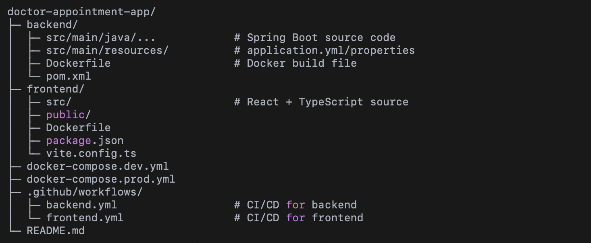

# **🏥 Doctor Appointment System**

> Full-stack Doctor Appointment Booking System built with **Java Spring Boot** (backend) and **React + Vite** (frontend), featuring **JWT authentication**, **Swagger documentation**, **Dockerized deployment**, and **CI/CD pipelines**.

## **🧰 Tech Stack**

### **Backend**

* **Java 17**
* **Spring Boot 3.3.1**
* **Spring Data JPA / PostgreSQL**
* **Spring Security with JWT**
* **Swagger / OpenAPI** for API documentation
* **Maven** for build management
* **Docker** for containerization

### **Frontend**

* **React 18** + **Vite**
* **TypeScript**
* **React Router 7**
* **Axios / Fetch API** for HTTP requests
* **Docker** for containerization

### **DevOps & CI/CD**

* **GitHub Actions** for automated build & deploy
* **Docker Hub** for container registry
* **Render.com** for backend deployment
* **Netlify** for frontend deployment
* **Environment configurations** (**.env.dev** / **.env.prod**)

## **⚡ Features**

* User authentication and role-based access (JWT)
* **Manage ****Doctors, Patients, Appointments, Schedules, Departments**
* Secure API endpoints with **Spring Security**
* API documentation via **Swagger UI**
* Responsive React frontend with routing
* CI/CD pipelines for automatic deployment to **Render** (backend) and **Netlify** (frontend)
* Dockerized for easy local and production setup

## **🔧 Project Structure**

## **🏗️ Local Setup**

### **Backend**

cd root folder
docker-compose -f docker-compose.dev.yml up --build

### **Frontend**

cd frontend
npm install
npm run dev

* **Backend: **http://localhost:8080/api
* **Frontend: **http://localhost:3000

## **🌐 Production Setup**

* Backend deployed to **Render**:
  * Environment variables for production in **backend-prod.yml**
  * Docker image pulled from **Docker Hub**
* Frontend deployed to **Netlify**:
  * **.env.production** points to Render backend URL
  * Build command: **npm run build**
  * Publish directory: **frontend/dist**

## **🔁 CI/CD**

* **Backend (GitHub Actions)**
  * Triggered on **develop** / **main** push
  * Steps:
    1. Checkout code
    2. Setup Java 17
    3. Build with Maven
    4. Docker login & push image to Docker Hub
    5. Pull image & deploy to Render
* **Frontend (GitHub Actions)**
  * Triggered on **develop** / **main** push
  * Steps:
    1. Checkout code
    2. Setup Node 20
    3. Install dependencies
    4. Build project (**npm run build**)
    5. Deploy to Netlify

## **📖 Swagger API Documentation**

* Access via:  /swagger-ui/index.html  < Provides full REST API reference for backend endpoints

## **🔗 Links**

* **Frontend:** [Frontend Uygulaması](https://my-doctor-app.netlify.app/)
* **Backend:** [Backend API](https://doctor-appointment-app-2k9u.onrender.com/)
